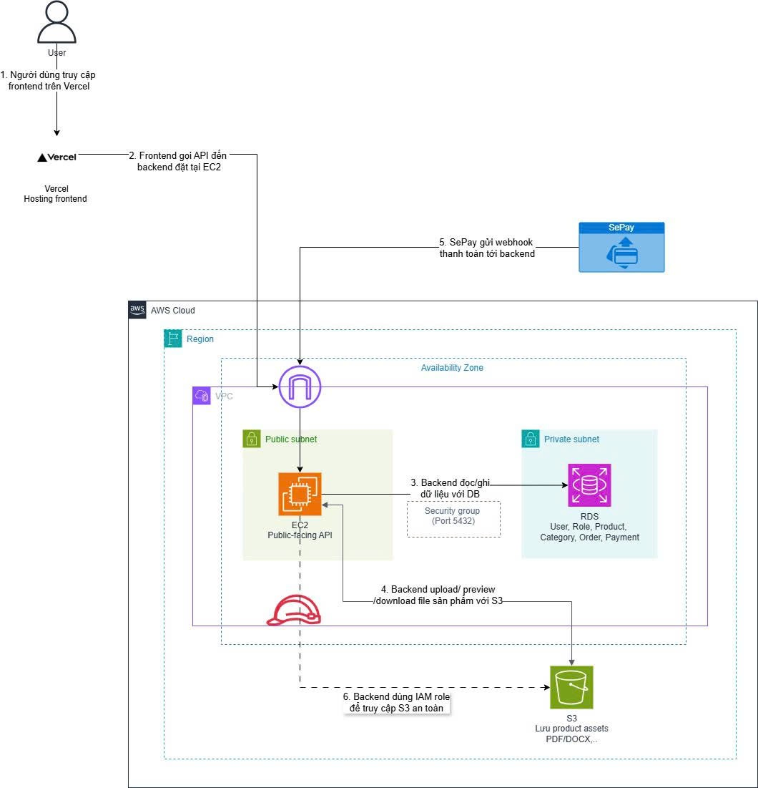

# Cloud-based Digital Product Marketplace with 3D Preview

## DaiMarket / AWS Marketplace DaiAI — Nền tảng marketplace sản phẩm số tích hợp xem trước 3D, thanh toán thời gian thực và lưu trữ trên AWS

### 1. Tóm tắt điều hành

_Về dự án_  
Dự án **DaiMarket / AWS Marketplace DaiAI** là một nền tảng marketplace dành cho sản phẩm số, tập trung vào các loại tài nguyên như tài liệu PDF/Word, template, ebook, mô hình 3D và asset thiết kế. Hệ thống cho phép người dùng đăng ký, đăng nhập, tìm kiếm sản phẩm, xem chi tiết, xem trước một phần nội dung, thanh toán và truy cập sản phẩm sau khi đơn hàng được xác nhận thành công.

Điểm nổi bật của dự án là khả năng xem trước mô hình 3D trực tiếp trên trình duyệt. Đối với sản phẩm dạng 3D, người dùng có thể quan sát mô hình trước khi mua; đối với tài liệu, hệ thống hỗ trợ preview giới hạn để người mua đánh giá nội dung trước khi quyết định thanh toán.

Về mặt triển khai, Frontend sử dụng React + Vite và hiện được deploy trên Vercel để có URL HTTPS ổn định. Backend Node.js + Express chạy trên Amazon EC2 bằng PM2, kết nối Amazon RDS PostgreSQL thông qua Prisma 7. File sản phẩm, thumbnail và model preview được lưu trên Amazon S3 theo prefix `products/`, còn EC2 truy cập S3 thông qua IAM Role theo nguyên tắc least privilege.

_Mục tiêu dự án_
 &emsp;- Áp dụng kiến thức AWS đã học vào một ứng dụng web thực tế có đầy đủ frontend, backend, database và file storage.
 &emsp;- Tách biệt compute và storage: EC2 xử lý nghiệp vụ, RDS lưu dữ liệu quan hệ, S3 lưu product assets.
 &emsp;- Xây dựng flow marketplace gồm buyer, seller/admin, product management, order, library và payment webhook.
 &emsp;- Thử nghiệm bảo mật truy cập bằng JWT, IAM Role và backend authorization trước khi cho phép tải file sản phẩm.
 &emsp;- Tạo nền tảng có thể mở rộng sang CloudFront, Route 53, CloudWatch, CI/CD và monitoring trong giai đoạn sau.

### 2. Tuyên bố vấn đề

_Vấn đề hiện tại_

Các hệ thống mua bán sản phẩm số thường gặp ba nhóm vấn đề chính: trải nghiệm xem trước sản phẩm chưa trực quan, lưu trữ file trên server ứng dụng khó mở rộng và quy trình xác nhận thanh toán thủ công còn chậm. Với các sản phẩm như mô hình 3D, nếu người mua chỉ nhìn ảnh bìa hoặc mô tả văn bản thì rất khó đánh giá đúng chất lượng sản phẩm.

Nếu file sản phẩm được lưu trực tiếp trên ổ đĩa của backend server, hệ thống dễ phụ thuộc vào dung lượng EC2, khó backup, khó mở rộng và có rủi ro mất file khi deploy hoặc thay đổi source code. Trên thực tế, trong quá trình triển khai thử nghiệm, việc lưu file tại `backend/storage/products` từng gây rủi ro khi git pull/stash làm lệch giữa metadata trong database và file vật lý.

Ngoài ra, quy trình thanh toán thủ công không phù hợp với mô hình marketplace. Hệ thống cần một cơ chế tự động nhận webhook giao dịch, đối chiếu mã đơn hàng, cập nhật trạng thái order và mở quyền truy cập file cho buyer sau khi thanh toán thành công.

_Giải pháp đề xuất_
 &emsp;- Frontend React/Vite cung cấp giao diện mua bán sản phẩm số, 3D Viewer, trang quản trị và thư viện cá nhân.
 &emsp;- Backend Node.js/Express xử lý API, xác thực JWT, phân quyền, upload product, order, webhook và kiểm tra quyền sở hữu sản phẩm.
 &emsp;- Amazon RDS PostgreSQL lưu dữ liệu người dùng, role, category, product metadata, order, order item, payment method và trạng thái giao dịch.
 &emsp;- Amazon S3 lưu file sản phẩm, thumbnail và model preview; backend upload/stream file từ S3 thay vì lưu lâu dài trên EC2.
 &emsp;- EC2 truy cập S3 bằng IAM Role `marketplace-ec2-s3-role`, không dùng access key hardcode trong source code.
 &emsp;- SePay webhook hỗ trợ tự động cập nhật order khi nhận thông báo giao dịch.

### 3. Kiến trúc giải pháp

Kiến trúc được thiết kế theo hướng tách lớp rõ ràng: lớp giao diện, lớp API, lớp dữ liệu quan hệ, lớp object storage và lớp bảo mật/quản trị quyền. Trong triển khai hiện tại, frontend được host trên Vercel; phương án mục tiêu có thể thay thế hoặc bổ sung CloudFront khi tài khoản AWS được xác minh và sẵn sàng dùng CDN.

<!--
{}
**Hình 2.1 chưa có** — Sơ đồ kiến trúc hệ thống DaiMarket trên AWS: thể hiện Vercel hoặc CloudFront cho frontend, EC2 backend, RDS PostgreSQL, S3 product assets, IAM Role, CloudWatch và SePay webhook. Tác dụng: cho người đọc thấy toàn cảnh các thành phần hệ thống và luồng dữ liệu giữa chúng.
{}
-->

Luồng tổng quát của hệ thống: người dùng truy cập frontend; frontend gọi API qua `/api`; request được chuyển đến backend EC2; backend xử lý nghiệp vụ, truy vấn RDS, upload hoặc stream file từ S3; khi có giao dịch thanh toán, SePay gửi webhook để backend xác nhận và cập nhật trạng thái đơn hàng.

**_Các thành phần triển khai_**

| Thành phần      | Triển khai hiện tại                                              | Vai trò trong hệ thống                                                                 |
| --------------- | ---------------------------------------------------------------- | -------------------------------------------------------------------------------------- |
| Frontend        | React + Vite deploy trên Vercel                                  | Cung cấp giao diện người dùng, product listing, admin dashboard, 3D viewer và library. |
| Backend API     | Node.js + Express trên Amazon EC2, chạy bằng PM2                 | Xử lý REST API, auth, role, product, order, SePay webhook và S3 streaming.             |
| Database        | Amazon RDS PostgreSQL                                            | Lưu dữ liệu quan hệ: user, role, category, product metadata, order, payment.           |
| Product Storage | Amazon S3 bucket `marketplace-frontend-thao`, prefix `products/` | Lưu file sản phẩm, thumbnail, preview model; backend truy cập bằng IAM Role.           |
| IAM             | `marketplace-ec2-s3-role`                                        | Cấp quyền PutObject/GetObject/DeleteObject/ListBucket giới hạn cho prefix `products/`. |
| Payment         | SePay webhook                                                    | Nhận thông báo giao dịch, đối chiếu mã đơn và cập nhật order SUCCESS.                  |
| Monitoring      | PM2 logs, AWS Budget; CloudWatch là hướng mở rộng                | Theo dõi lỗi backend, chi phí và có thể mở rộng sang logs/alarms.                      |

<!--
{}
**Ghi chú về kiến trúc mục tiêu và kiến trúc thực tế**
 &emsp;- Trong sơ đồ mục tiêu có Route 53, ACM, CloudFront và WAF. Các thành phần này phù hợp cho production, nhưng chưa phải toàn bộ đã triển khai trong bản demo hiện tại.
 &emsp;- Vercel đang thay thế vai trò frontend hosting/CDN trong giai đoạn demo vì CloudFront bị chặn bởi bước xác minh tài khoản AWS.
 &emsp;- S3 đã được chuyển sang đúng mục đích lưu trữ product assets. Bucket vẫn nên private; user không đọc trực tiếp object nếu chưa qua backend kiểm tra quyền.
 &emsp;- Backend hiện stream file từ S3 về client sau khi xác thực quyền sở hữu. Trong giai đoạn sau có thể chuyển sang presigned URL để giảm tải EC2.
{}
-->

### 4. Triển khai kỹ thuật

_4.1. Backend và database_
 &emsp;- Backend Node.js + Express được deploy trên EC2 Ubuntu và quản lý process bằng PM2.
 &emsp;- Prisma 7 kết nối RDS PostgreSQL thông qua `@prisma/adapter-pg`.
 &emsp;- Lỗi kết nối RDS qua Node/Prisma đã được xử lý bằng cấu hình SSL trong Prisma adapter.
 &emsp;- Required seed dùng upsert để tạo role admin/buyer/seller, payment methods và categories mà không xóa dữ liệu thật.
 &emsp;- API chính gồm auth, admin, products, categories, seller applications, orders, webhook, withdrawals và library.

_4.2. Product storage trên Amazon S3_
 &emsp;- Ban đầu file sản phẩm được lưu trong `backend/storage/products` trên EC2, nhưng cách này không ổn định khi deploy và không phù hợp mở rộng.
 &emsp;- Backend đã chuyển sang `multer.memoryStorage` để nhận file tạm trong RAM, sau đó upload buffer lên S3 bằng AWS SDK.
 &emsp;- Database lưu `fileUrl` dạng filename và `storageKey` dạng `products/<uuid>.<ext>` để truy xuất file từ S3.
 &emsp;- Khi user xem thumbnail, preview model hoặc tải file trong library, backend lấy object từ S3 và stream về browser.
 &emsp;- EC2 đã được attach IAM Role `marketplace-ec2-s3-role` và đã test thành công PutObject, ListObject, DeleteObject với S3 prefix `products/`.

_4.3. Frontend và routing_
 &emsp;- Frontend React/Vite được deploy trên Vercel.
 &emsp;- Đã xử lý SPA routing bằng rewrite để các route như `/login`, `/register`, `/products` có thể truy cập trực tiếp.
 &emsp;- Vercel rewrite `/api/*` về backend EC2 để tránh lỗi mixed content và giúp frontend gọi API bằng relative path.
 &emsp;- Các lỗi hardcode localhost trong frontend API đã được rà soát và sửa về `/api/...` để phù hợp với môi trường deploy.

_4.4. Payment và quyền truy cập sau mua_
 &emsp;- Order được tạo ở trạng thái PENDING sau khi buyer checkout.
 &emsp;- SePay webhook nhận nội dung chuyển khoản, tách mã đơn `DAIMxxxxxxxx`, tìm order tương ứng và cập nhật PENDING sang SUCCESS.
 &emsp;- Library chỉ hiển thị/tải sản phẩm khi user có Order SUCCESS chứa product đó.
 &emsp;- Download và preview đi qua backend để kiểm tra JWT và quyền sở hữu trước khi stream file từ S3.

### 5. Lộ trình & Mốc triển khai

| Mốc           | Nội dung chính                                                                           | Kết quả                                                    |
| ------------- | ---------------------------------------------------------------------------------------- | ---------------------------------------------------------- |
| Giai đoạn 1   | Học EC2, S3, IAM, AWS Budget; xác định đề tài marketplace sản phẩm số.                   | Nắm được dịch vụ AWS cần dùng và phạm vi MVP.              |
| Giai đoạn 2   | Khởi tạo React/Vite + Node.js/Express + Prisma/PostgreSQL; xây dựng database schema.     | Có nền tảng auth, product, category, order.                |
| Giai đoạn 3   | Phát triển frontend, 3D viewer, admin dashboard, search, product detail, SePay flow.     | Hoàn thành các chức năng nghiệp vụ chính.                  |
| Giai đoạn 4   | Deploy backend lên EC2, kết nối RDS, xử lý lỗi Prisma/RDS SSL, seed required data.       | API public hoạt động, database cloud chạy ổn định.         |
| Giai đoạn 5   | Deploy frontend lên Vercel, sửa SPA routing/API rewrite, chuyển product storage sang S3. | MVP deploy thành công: Vercel + EC2 + RDS + S3 + IAM Role. |
| Giai đoạn sau | Hoàn thiện CloudFront/Route 53/ACM, monitoring CloudWatch, CI/CD và presigned URL.       | Tiến gần hơn tới kiến trúc production.                     |

### 6. Ước tính ngân sách

Dự án được triển khai theo hướng tiết kiệm chi phí để phục vụ mục tiêu học tập và demo thực tập. Số liệu cuối cùng sẽ được cập nhật bằng AWS Billing hoặc AWS Pricing Calculator tại thời điểm nộp báo cáo, vì chi phí phụ thuộc region, instance type, thời gian chạy, dung lượng lưu trữ và data transfer.

<!--
{}
**Hình 2.2 chưa có** — Ảnh chụp AWS Billing/Budget hoặc AWS Pricing Calculator thể hiện tổng chi phí dự kiến theo tháng cho EC2, RDS, S3 và data transfer. Tác dụng: làm bằng chứng số liệu ngân sách thực tế thay cho ước tính lý thuyết.
{}
-->

| Dịch vụ               | Cấu hình/Phạm vi dùng                                                     | Trạng thái | Ước tính                         |
| --------------------- | ------------------------------------------------------------------------- | ---------- | -------------------------------- |
| Amazon EC2            | 1 instance Ubuntu chạy backend Node.js bằng PM2                           | Đang dùng  | ~7.59$/tháng                     |
| Amazon RDS PostgreSQL | Single-AZ, db.t4g.micro, 20 GiB gp3                                       | Đang dùng  | ~13$/tháng                       |
| Amazon S3             | Bucket `marketplace-frontend-thao`, prefix `products/` cho product assets | Đang dùng  | ~0.18$/tháng                     |
| IAM Role/Policy       | `marketplace-ec2-s3-role`                                                 | Đang dùng  | Không tính phí riêng.            |
| Vercel                | Frontend hosting                                                          | Đang dùng  | Free                             |
| AWS Budget            | Theo dõi chi phí/logs                                                     | Một phần   | AWS Budget không tính phí cơ bản |

### 7. Đánh giá rủi ro

| Rủi ro                                                       | Ảnh hưởng  | Xác suất        | Chiến lược giảm thiểu                                                                          |
| ------------------------------------------------------------ | ---------- | --------------- | ---------------------------------------------------------------------------------------------- |
| CloudFront/Route 53 chưa dùng được do xác minh tài khoản AWS | Trung bình | Trung bình      | Dùng Vercel làm frontend hosting tạm thời; giữ CloudFront là phương án production sau.         |
| Lỗi kết nối Prisma/RDS do SSL                                | Cao        | Đã xảy ra       | Cấu hình SSL trong Prisma adapter; test bằng pg driver và Prisma runtime trước khi chạy seed.  |
| Mất đồng bộ metadata DB và file local trên EC2               | Cao        | Đã xảy ra       | Chuyển product storage sang S3; tránh phụ thuộc `backend/storage/products`.                    |
| S3 permission sai khiến upload/download lỗi                  | Cao        | Trung bình      | Dùng IAM Role cho EC2; giới hạn policy theo prefix `products/` và test Put/Get/Delete.         |
| Xóa product đã có order gây lỗi foreign key                  | Trung bình | Trung bình      | Không xóa cứng product đã có order; đề xuất soft delete/isActive trong giai đoạn sau.          |
| Sai lệch trạng thái thanh toán/webhook                       | Cao        | Trung bình      | Dùng mã đơn DAIM + idempotency; kiểm tra status order và log webhook.                          |
| Vượt chi phí cloud trong giai đoạn demo                      | Trung bình | Thấp-Trung bình | Bật budget alert, dùng Single-AZ, tắt dịch vụ không cần thiết, tránh NAT/ALB/WAF nếu chưa cần. |

### 8. Kết quả kỳ vọng

- Hoàn thành MVP marketplace sản phẩm số gồm login/register, search, product detail, 3D preview, admin product/category management, order và library.
- Backend chạy ổn định trên Amazon EC2 và kết nối Amazon RDS PostgreSQL để lưu dữ liệu quan hệ.
- Product files, thumbnails và preview models được lưu trên Amazon S3 thay vì EC2 local disk.
- Người dùng chỉ xem/tải file sau khi backend xác thực JWT và kiểm tra quyền sở hữu sản phẩm.
- SePay webhook hỗ trợ tự động cập nhật trạng thái thanh toán từ PENDING sang SUCCESS.
- Dự án có sơ đồ kiến trúc rõ ràng, thể hiện được compute, storage, database, IAM và payment integration.
- Hình thành cơ sở để mở rộng sang seller approval, soft delete product, CloudFront/Route 53/ACM, CloudWatch logging, CI/CD và presigned URL.

<!--
### 9. Danh sách hình ảnh/chứng cứ sẽ bổ sung
{}
Các hình bên dưới **chưa có** và sẽ được chèn vào báo cáo sau khi chụp/vẽ xong. Bảng mô tả rõ từng hình cần thể hiện nội dung gì.
{}

Mã hình | Tên hình/chứng cứ | Nội dung cần thể hiện
|---|---|---|
|Hình 2.1 | Sơ đồ kiến trúc hệ thống DaiMarket trên AWS | Vercel hoặc CloudFront, EC2 backend, RDS, S3 product assets, IAM Role, SePay webhook.|
|Hình 2.2 | AWS Billing/Budget hoặc Pricing Calculator | Chi phí dự kiến theo tháng cho EC2, RDS, S3 và data transfer.|
|Hình 2.3 | EC2 IAM Role | Instance backend có IAM Role `marketplace-ec2-s3-role`.|
|Hình 2.4 | S3 bucket `products/` | Object mới xuất hiện sau khi admin upload sản phẩm.|
|Hình 2.5 | API health/products/categories | curl hoặc browser trả response thành công.|
|Hình 2.6 | Demo frontend | Trang chủ/search/product detail/library/admin hoạt động trên Vercel.|
|Hình 2.7 | SePay webhook/order status | Webhook nhận request và order chuyển SUCCESS nếu có giao dịch test hợp lệ.|
-->
