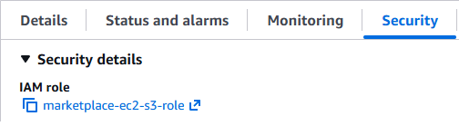
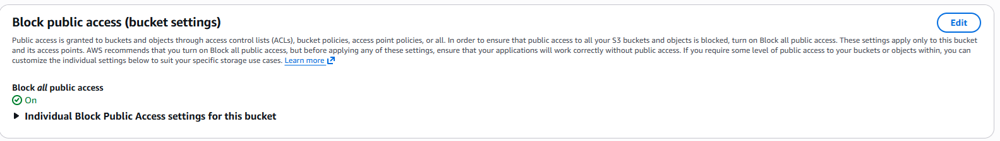

#### Tài khoản và công cụ cần có

- Tài khoản AWS sử dụng region **us-east-1**.
- Repository GitHub chứa mã nguồn frontend và backend.
- Tài khoản Vercel kết nối với GitHub để deploy frontend.
- Key pair SSH để truy cập EC2 hoặc phương thức truy cập EC2 phù hợp.
- Node.js 22 trên server backend, npm, PM2, Git, PostgreSQL client và AWS CLI v2.
- Amazon RDS PostgreSQL và S3 bucket/prefix private để lưu file sản phẩm.
- SePay API key và thông tin ngân hàng để kiểm thử webhook thanh toán.

#### Biến môi trường

{}
Lời nhắc nhở thân thiện: Không nên đưa tệp dotenv vào Git hoặc dán chúng vào cuộc hội thoại với AI. Mật khẩu cơ sở dữ liệu, mã bí mật JWT, khóa API SePay và số tài khoản ngân hàng bên dưới đã được che giấu/kiểm duyệt một cách có chủ đích.
{}

```text
PORT=5000
NODE_ENV=production
DATABASE_URL=postgresql://postgres:<PASSWORD>@<RDS-ENDPOINT>:5432/marketplace
JWT_SECRET=<long-random-secret>
CORS_ORIGIN=<example: https://daiai-aws.vercel.app>
SEED_MOCK_DATA=false
AWS_REGION=us-east-1
S3_BUCKET_NAME=<bucket-name>
S3_PRODUCT_PREFIX=products
SEPAY_API_KEY=<masked>
BANK_BIN=<masked-or-bank-bin>
BANK_NAME=MB Bank
BANK_ACCOUNT_NO=<masked>
BANK_ACCOUNT_NAME=<masked>
```

#### Mô hình phân quyền IAM

EC2 sử dụng **IAM Role** thay vì access key tĩnh. Cách này tránh lưu long-term credential trên server. Role chỉ được cấp quyền trong prefix `products/` của bucket đã chọn.


```json
{
  "Version": "2012-10-17",
  "Statement": [
    {
      "Sid": "ListBucketProductPrefix",
      "Effect": "Allow",
      "Action": ["s3:ListBucket"],
      "Resource": "arn:aws:s3:::marketplace-frontend-thao",
      "Condition": { "StringLike": { "s3:prefix": ["products/*"] } }
    },
    {
      "Sid": "ManageProductObjects",
      "Effect": "Allow",
      "Action": ["s3:GetObject", "s3:PutObject", "s3:DeleteObject"],
      "Resource": "arn:aws:s3:::marketplace-frontend-thao/products/*"
    }
  ]
}
```
* S3 cũng cần được bật Block All Public Access nếu chưa bật


<!-- INSERT FIGURE 5.2: Ảnh tab Security của EC2 hiển thị IAM Role = marketplace-ec2-s3-role. -->
<!-- INSERT FIGURE 5.3: Ảnh S3 bucket bật Block all public access. -->
