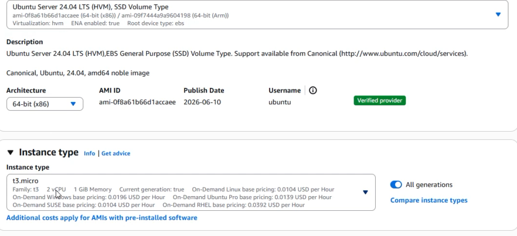
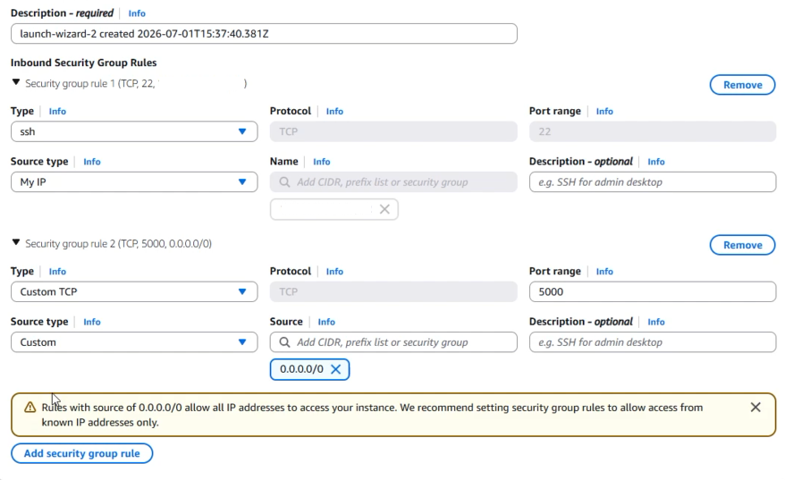
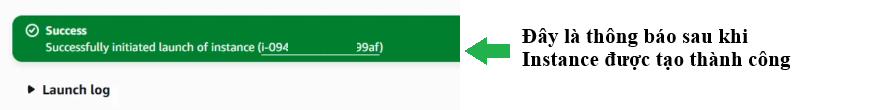
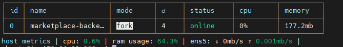
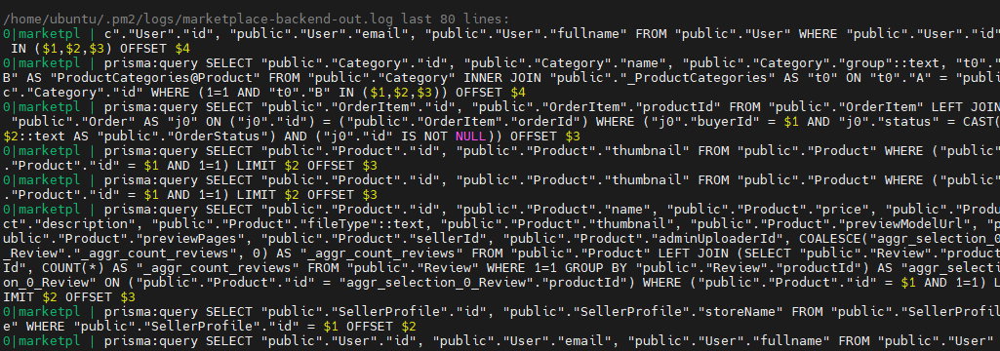

#### Các bước

- Tạo **Ubuntu EC2 instance** ở region us-east-1.
- Cấu hình Security Group: SSH 22 từ My IP; port 5000 để test backend HTTP; nếu production cần thay bằng HTTPS/domain.
- Kết nối bằng SSH hoặc MobaXterm với user `ubuntu` và private key đúng.
- Cài Git, Node.js 22, npm, PM2, PostgreSQL client và AWS CLI v2.
- Clone/pull GitHub repository và cài dependency cho backend.
- Khởi động backend bằng PM2 và lưu startup config.




<!--chèn hình ảnh các bước tạo ec2-->

```bash
# Cài đặt server
sudo apt update && sudo apt upgrade -y
curl -fsSL https://deb.nodesource.com/setup_22.x | sudo -E bash -
sudo apt install -y nodejs git postgresql-client unzip curl
sudo npm install -g pm2

# AWS CLI v2 nếu apt không có sẵn package
cd /tmp
curl "https://awscli.amazonaws.com/awscli-exe-linux-x86_64.zip" -o "awscliv2.zip"
unzip -q awscliv2.zip
sudo ./aws/install
aws --version

# Chạy backend
cd ~/daiai-aws-MarketplaceV1/backend
npm install
pm2 start server.js --name marketplace-backend
pm2 save
pm2 startup
```

#### Kiểm tra

```bash
pm2 status
pm2 logs marketplace-backend --lines 80
curl http://localhost:5000/health
curl http://localhost:5000/api/products
```
* Test pm2 status

* Test pm2 logs


<!-- INSERT FIGURE 5.4: Ảnh PM2 status và kết quả /health. Nếu báo cáo public, che public IP. -->
