#### Cấu hình RDS

- Engine: **PostgreSQL**.
- Deployment: **Single-AZ** DB instance để tối ưu chi phí.
- Instance class: **db.t4g.micro** cho môi trường demo.
- Storage: gp3, 20 GiB, tắt autoscaling nếu chưa cần.
- Public access: **No**. RDS chỉ cho EC2 Security Group truy cập.
- Database name: `marketplace`.
- Encryption: default AWS/RDS key.

#### Deploy Prisma

Vì project dùng **Prisma 7**, runtime cần đọc `DATABASE_URL` thông qua adapter config, còn migration dùng Prisma CLI script. Backend đã được chỉnh để load dotenv và dùng `PrismaPg` với SSL setting phù hợp RDS.

```bash
cd ~/daiai-aws-MarketplaceV1/backend
npm run generate
node -r dotenv/config ./node_modules/prisma/build/index.js migrate deploy
node prisma/seed-required.js
```

#### Seed data

- Role: `admin`, `buyer`, `seller`.
- Payment method: MoMo, ZaloPay, MB Bank, VNPay.
- Category có group `DOCUMENT` và `MODEL_3D`.
- Seed production chỉ dùng **upsert**, không xóa Product, User, Order hoặc OrderItem.

#### Kiểm tra

```bash
psql -h <RDS-ENDPOINT> -U postgres -d marketplace -p 5432 -c 'SELECT * FROM "Role";'
psql -h <RDS-ENDPOINT> -U postgres -d marketplace -p 5432 -c 'SELECT id, name, "group" FROM "Category" ORDER BY "group", name;'
```

<!-- INSERT FIGURE 5.5: Ảnh RDS summary và Security Group cho phép PostgreSQL từ EC2 SG. -->
<!-- INSERT FIGURE 5.6: Output psql cho seed data Role và Category. -->
### Các bước tạo RDS
# 1.Engine Settings
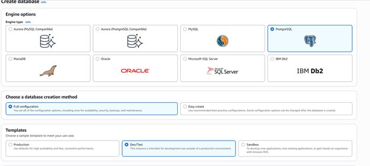
# 2.Availability and durability
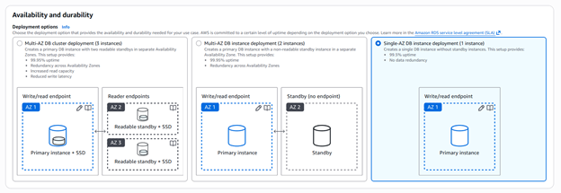
# 3.Settings
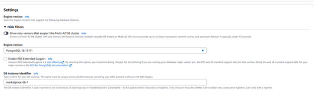
# 4.Credentials Settings
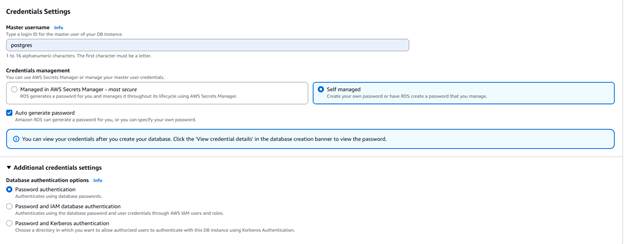
# 5.Instance Configs
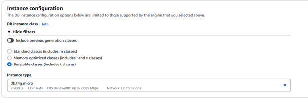
# 6.Storage settings
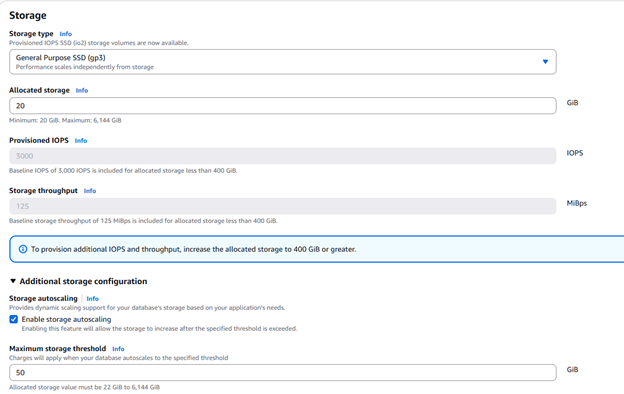
# 7.Connectivity part 1
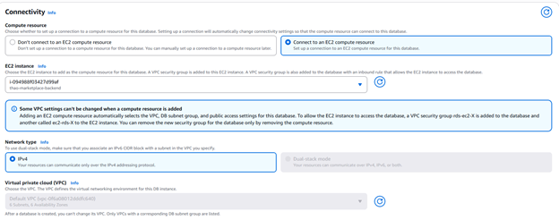
# 8.Connectivity part 2
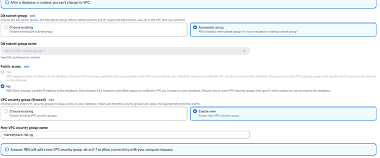
# 9.Connectivity part 3
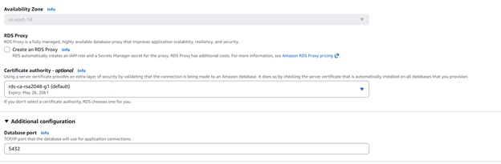
# 10.Monitoring settings
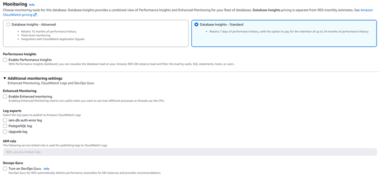
# 11.Additional config part 1
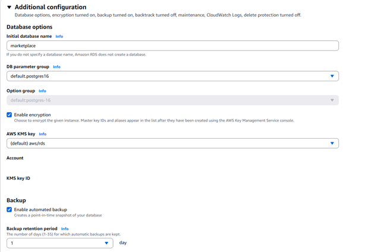
# 12.Additional config part 2
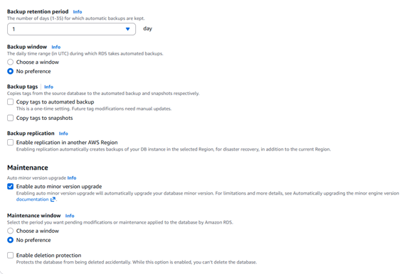
# 13. Estimated monthly costs
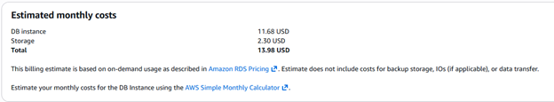