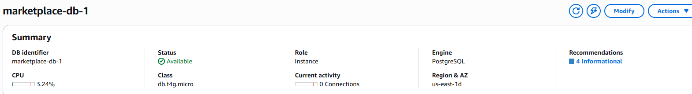

Phần này mô tả cách backend được deploy lên **Amazon EC2** và kết nối **Amazon RDS PostgreSQL**. Backend là tầng tin cậy dùng để validate JWT, kiểm tra role, thao tác với RDS và stream file S3 sau khi xác thực quyền truy cập.

#### Dịch vụ backend

- **Amazon EC2** host Express backend.
- **PM2** giữ tiến trình Node.js chạy với tên `marketplace-backend`.
- **Amazon RDS PostgreSQL** lưu dữ liệu quan hệ.
- **Prisma 7** với `@prisma/adapter-pg` dùng để truy cập database.
- Backend expose các route `/health`, `/api/auth`, `/api/products`, `/api/categories`, `/api/orders`, `/api/library`, `/api/admin`, `/api/withdrawals` và `/webhook`.

#### Nội dung

- [Tạo và cấu hình EC2 backend](5.3.1-create-configure-ec2-backend/)
- [Cấu hình RDS PostgreSQL và Prisma](5.3.2-configure-rds-postgresql-prisma/)
