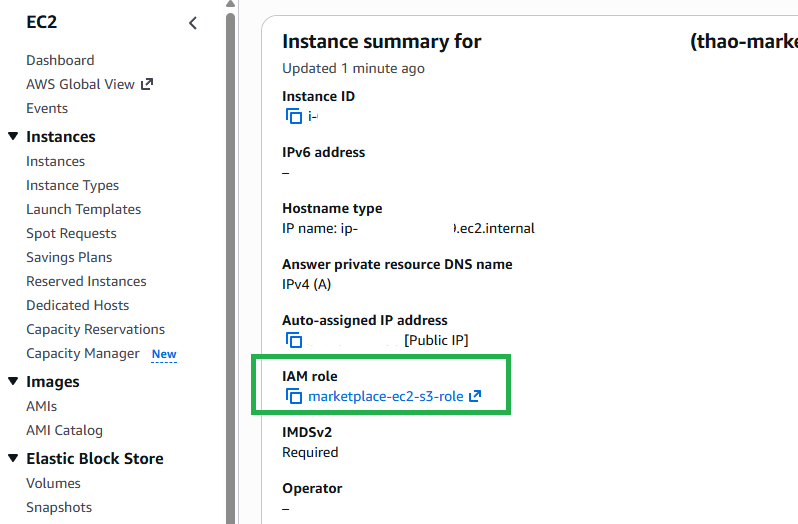

#### Tạo IAM Role cho EC2

1. Tạo role `marketplace-ec2-s3-role` với trusted service là **EC2**.
2. Gắn inline policy giới hạn đúng prefix sản phẩm:
   - `s3:ListBucket` trên `arn:aws:s3:::marketplace-frontend-thao` với điều kiện `s3:prefix = products/*`
   - `s3:GetObject`, `s3:PutObject`, `s3:DeleteObject` trên `arn:aws:s3:::marketplace-frontend-thao/products/*`
3. Gắn role vào instance qua **EC2 > Actions > Security > Modify IAM role**.
4. Giữ nguyên **S3 Block Public Access** — backend truy cập S3 qua role, không có object public.

<!-- INSERT FIGURE 5.8: Ảnh tab Security của EC2 instance hiển thị marketplace-ec2-s3-role đã gắn, và inline IAM policy. -->


#### Kiểm tra role từ EC2 (IMDSv2)

```bash
TOKEN=$(curl -s -X PUT "http://169.254.169.254/latest/api/token" \
  -H "X-aws-ec2-metadata-token-ttl-seconds: 21600")
curl -s -H "X-aws-ec2-metadata-token: $TOKEN" \
  http://169.254.169.254/latest/meta-data/iam/security-credentials/
# Kết quả mong đợi: marketplace-ec2-s3-role
```

#### Test thao tác S3 bằng AWS CLI

```bash
echo "s3 role test" > /tmp/s3-test.txt
aws s3 cp /tmp/s3-test.txt s3://marketplace-frontend-thao/products/_test/s3-test.txt --region us-east-1
aws s3 ls s3://marketplace-frontend-thao/products/_test/ --region us-east-1
aws s3 rm s3://marketplace-frontend-thao/products/_test/s3-test.txt --region us-east-1
```

#### Thay đổi code backend

| File | Thay đổi |
| --- | --- |
| `src/config/s3.js` | Helper mới dùng `@aws-sdk/client-s3` (upload, get, delete) |
| `src/middlewares/upload.middleware.js` | Multer `diskStorage` → `memoryStorage` |
| `src/controllers/product.controller.js` | Upload file/thumbnail/model sản phẩm lên S3; stream từ S3 |
| `src/controllers/library.controller.js` | `GetObject` download sau khi kiểm tra quyền sở hữu |
| `package.json` | Thêm dependency `@aws-sdk/client-s3` |

#### Quy ước storage key

```text
fileUrl          = <uuid>.docx        -> storageKey = products/<uuid>.docx
thumbnail        = <uuid>.png         -> storageKey = products/<uuid>.png
previewModelUrl  = <uuid>.glb         -> storageKey = products/<uuid>.glb
```

#### Migrate file cũ

```bash
cd ~/daiai-aws-MarketplaceV1/backend
aws s3 sync storage/products/ s3://marketplace-frontend-thao/products/ --region us-east-1
```
