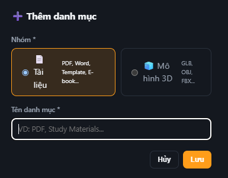
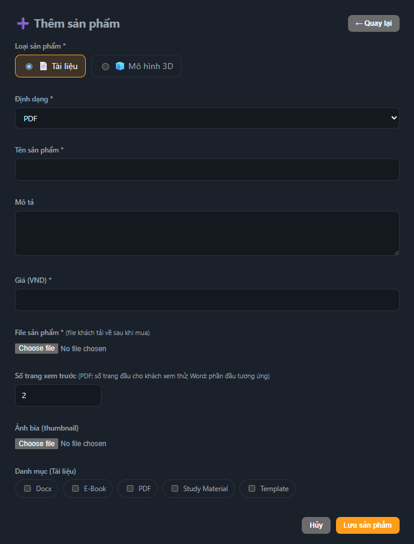
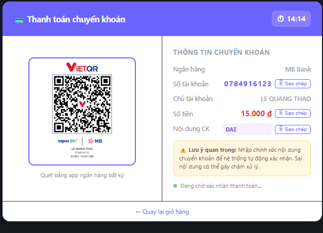
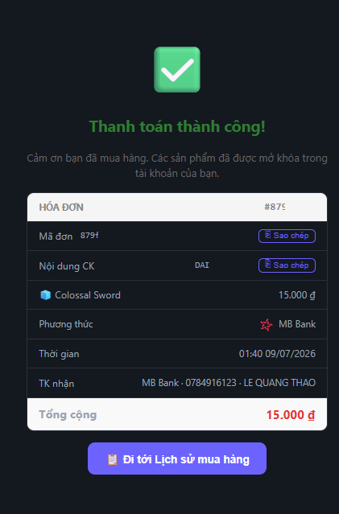

#### Cấp quyền admin

Cập nhật role trực tiếp trong database, sau đó logout và login lại để JWT mang role mới:

```sql
UPDATE "User"
SET "roleId" = (SELECT id FROM "Role" WHERE name = 'admin')
WHERE email = '<admin-email>'
RETURNING id, email, "roleId";
```

#### Validation theo category group

Category của sản phẩm phải khớp với loại file: category thuộc nhóm **DOCUMENT** nhận file tài liệu, category thuộc nhóm **MODEL_3D** nhận file mô hình 3D. 

<!-- INSERT FIGURE 5.11: Ảnh admin dashboard hiển thị duyệt sản phẩm và validation theo category group. -->



#### Luồng thanh toán SePay

- Route webhook: `POST /webhook/sepay` với header `Authorization: Apikey <SEPAY_API_KEY>`.
- Định dạng mã đơn: `DAIM` + 8 ký tự hex đầu của order UUID, nhúng trong nội dung chuyển khoản.
- Khi webhook khớp, đơn hàng chuyển **PENDING → SUCCESS** và buyer được cấp quyền library qua các bản ghi `OrderItem` liên quan.

<!-- INSERT FIGURE 5.12: Ảnh webhook SePay được gửi và trạng thái đơn hàng chuyển từ PENDING sang SUCCESS. -->



#### Vấn đề đã biết: xóa sản phẩm đã được mua

Hard-delete sản phẩm đã xuất hiện trong đơn hàng sẽ lỗi foreign key constraint trên `OrderItem`. Cách xử lý khuyến nghị là **soft delete** (có thể dùng cờ `isDeleted`/`isActive`) để giữ nguyên lịch sử mua trong khi sản phẩm biến mất khỏi storefront.
