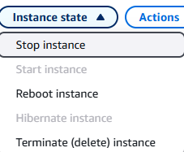
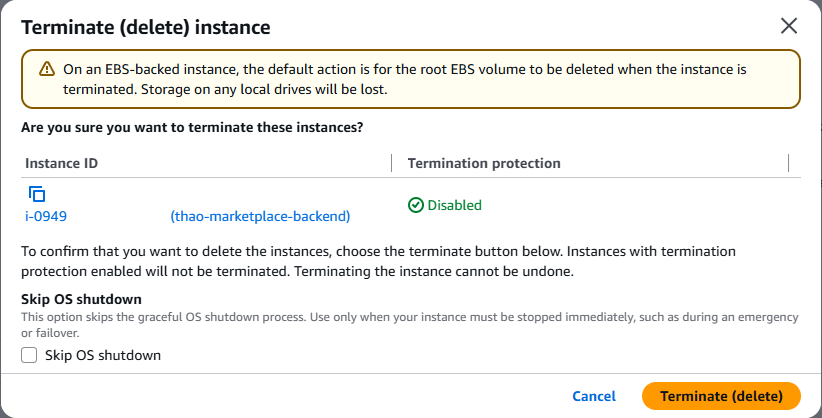
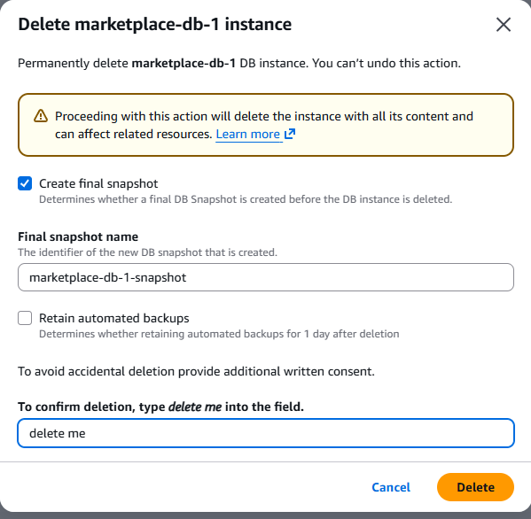
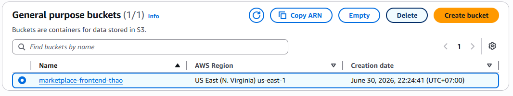
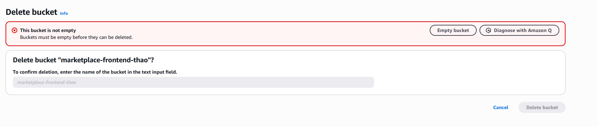
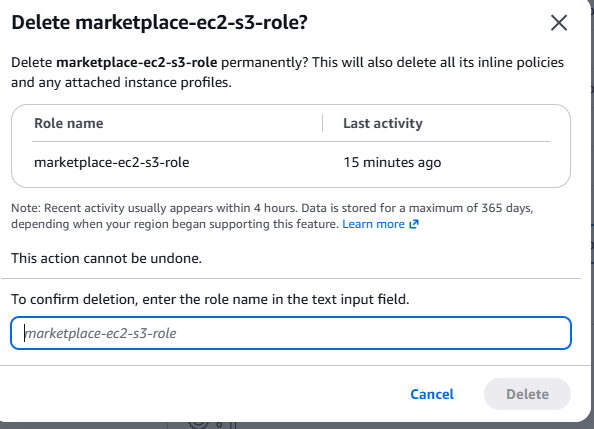

#### Quyết định thiết kế tiết kiệm chi phí

- Không dùng NAT Gateway, ALB, Multi-AZ RDS, WAF trả phí hay RDS Proxy — bản demo đã được chạy với footprint nhỏ nhất có thể.
- Bật AWS Budget alerts để phát hiện chi phí bất thường.
- CloudFront, Route 53 và ACM có thể dùng, nhưng phải đảm bảo kiểm soát tốt chi phí & nên cập nhật Budget alerts cho mỗi dịch vụ được dùng.

#### Dọn dẹp

- Stop hoặc terminate EC2 instance.
    + Bước 1: Vào AWS Console -> Search dịch vụ EC2 -> Chọn Instance muốn xóa -> Click vào Instance state -> Terminate (delete) Instance 
    
    + Bước 2: Ấn delete và xác nhận delete 
    

- Xóa RDS instance (snapshot lần cuối nếu cần giữ dữ liệu).

- Empty và xóa S3 bucket, hoặc chỉ giữ các object `products/` cần thiết.

- Gỡ IAM role và inline policy.

- Xóa project Vercel hoặc tạm dừng deployment, do Vercel là miễn phí nên không cần xóa.

#### Hướng phát triển tiếp theo

- HTTPS cho backend qua custom domain với proxy, ALB hoặc API Gateway.
- Presigned URL để download trực tiếp từ S3 có giới hạn thời gian.
- Chuyển secrets sang SSM Parameter Store hoặc Secrets Manager.
- CloudWatch logs, metrics và alarms cho backend.
- Soft delete cho sản phẩm đã có trong đơn hàng.
- Pipeline CI/CD cho backend và frontend.
